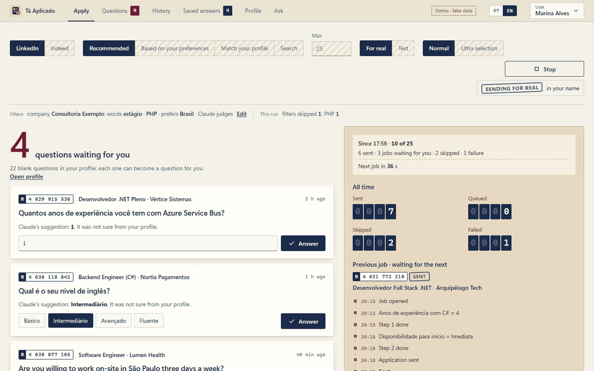

# Tá Aplicado

**Your job applications on autopilot, with your own Claude, on your own computer, and nothing sent without a receipt.**

Tá Aplicado ("done, applied" in Brazilian Portuguese) is a Windows desktop app that applies to jobs on **LinkedIn Easy Apply** and **Indeed**, using **Claude Code** to answer the application forms from a profile you write once.

[Português](README.pt-BR.md)



<sub>Demo mode with made-up data. Open `wwwroot/index.html` in any browser to click around it yourself.</sub>

## Why it's different

- **Your Claude, not someone's API bill.** It runs through Claude Code with your Claude Pro or Max subscription. No API key, no monthly fee, no middleman.
- **Runs on your computer.** Your profile, answers and history stay in a local folder. There is no server and no telemetry; the developer receives nothing.
- **It asks instead of guessing.** When Claude isn't sure (a salary in another currency, a skill you never listed), the question waits for you. You answer once, and every future form reuses it.
- **Every application has a receipt.** The History tab shows each job's trail and exactly which answers went out in your name.
- **It filters before it applies.** Claude reads each job and skips what doesn't fit your profile, your cities, or your country and language rules.

## What it does

| Screen | What it's for |
|---|---|
| **Apply** | Pick the site (LinkedIn or Indeed), the source (recommended, preferences, profile match or a search), a max, and test or real mode. Watch the run live. |
| **Questions** | Questions Claude couldn't answer from your profile. Answer them and the jobs go back in the queue. |
| **History** | Every job with its status (sent, waiting for you, queued, skipped, failed), its steps and its receipt. |
| **Saved answers** | Every answer ever given, reused automatically. Approve or fix the ones Claude gave on its own. |
| **Profile** | The questionnaire Claude answers from. Import it from your LinkedIn profile or from your resume. |
| **Ask** | Paste a recruiter's questionnaire; get each answer plus a reply message ready to send. |

There is also **Ultra selection** (score many jobs, apply only to the best), a **no-AI mode** (saved answers only), several **users** per computer, and a **PT | EN** switch.

## Requirements

- **Windows 10 or 11** (WebView2 comes with Windows 11).
- **Google Chrome.**
- **[Claude Code](https://claude.ai/code)** logged in with a **Claude Pro or Max** account. The app's setup screen installs and logs it in for you.
- To build from source: **[.NET 8 SDK](https://dotnet.microsoft.com/download/dotnet/8.0)**. Claude Code is reached through [ClaudeCodeBridge](https://github.com/IsaiasGabrielDev/ClaudeCodeBridge), a NuGet package restored on build.

## Install

**Download:** grab the zip from [Releases](https://github.com/IsaiasGabrielDev/TaAplicado/releases/latest), unzip it and run `TaAplicado.exe`. .NET is bundled.

**From source:**

```bash
git clone https://github.com/IsaiasGabrielDev/TaAplicado.git
cd TaAplicado
dotnet run
```

## How to use

1. **Before you start.** The Apply screen checks Claude and Chrome and asks you to read where your data goes and the automation risk.
2. **Fill in your Profile**, or import it from your LinkedIn link or a pasted resume. Blank questions become questions for you later.
3. **Apply.** Start with **Test** and a small **Max**: the app fills the forms and discards them. Log in to LinkedIn or Indeed in the Chrome window the first time; the session is kept.
4. **Come back later.** Answer what's waiting in **Questions**, check **Saved answers**, and read the receipts in **History**.

## Your data

Everything lives in `%APPDATA%\LinkedInAutoApply\users\<user>\` on your computer. The app sends your profile, the form questions and job descriptions **to Anthropic (Claude)** through your own Claude account, and the application answers **to LinkedIn or Indeed**. Each Claude call is isolated: no tools, no saved transcript, no global Claude Code settings. **Profile → Your data → Delete this user** erases a person's whole folder.

## ⚠️ Be careful

Automating applications goes against LinkedIn's and Indeed's terms of use, and **your account can be restricted**. The app keeps human-like pauses, a max per run, and stops at LinkedIn's daily Easy Apply limit, but the risk is yours. Indeed often shows a human check to automated browsers: the app pauses and waits for you to solve it, and never tries to get around it.

## Project layout

| File | Role |
|---|---|
| `Program.cs` | Window (Photino), users, bridge to the UI |
| `Runner.cs` | A run: job lists, queue, limits, login |
| `EasyApply.cs` | LinkedIn Easy Apply form filling (Playwright) |
| `Indeed.cs` | Indeed apply flow ([page map](docs/indeed.md)) |
| `Answers.cs` | Saved answers, questions for you, Claude calls, relevance check |
| `agent-rules.md` | The rules Claude follows when answering and filtering |
| `wwwroot/` | Plain HTML, CSS and JS UI; `i18n.js` holds the English; `demo.js` the made-up data |

Self-check of the pure logic: `dotnet run -- --selfcheck`.

## License

[MIT](LICENSE)
