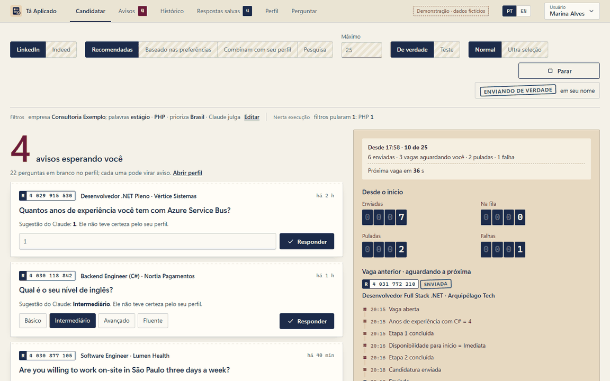

# Tá Aplicado

**Suas candidaturas no piloto automático, com o seu próprio Claude, no seu computador, e nada enviado sem recibo.**

Aplicativo desktop para Windows que se candidata a vagas pelo **Easy Apply do LinkedIn** e pelo **Indeed**, usando o **Claude Code** para responder os formulários a partir de um perfil que você preenche uma vez.

[English](README.md)



<sub>Modo demonstração, com dados fictícios. Abra `wwwroot/index.html` em qualquer navegador para clicar por conta própria.</sub>

## O que muda

- **O seu Claude, não uma conta de API de alguém.** Roda pelo Claude Code com a sua assinatura Claude Pro ou Max. Sem chave de API, sem mensalidade, sem intermediário.
- **Roda no seu computador.** Perfil, respostas e histórico ficam numa pasta local. Não há servidor nem telemetria; o desenvolvedor não recebe nada.
- **Pergunta em vez de chutar.** Quando o Claude não tem certeza (pretensão em outra moeda, uma competência que você não listou), a pergunta vira um **aviso** para você. Você responde uma vez, e todo formulário seguinte reusa.
- **Toda candidatura tem recibo.** O Histórico mostra o caminho de cada vaga e exatamente quais respostas saíram em seu nome.
- **Filtra antes de candidatar.** O Claude lê cada vaga e pula o que não combina com o seu perfil, as suas cidades ou as suas regras de país e idioma.

## Telas

| Tela | Para quê |
|---|---|
| **Candidatar** | Escolha o site (LinkedIn ou Indeed), a origem (recomendadas, preferências, combinam com seu perfil ou pesquisa), o máximo e se é teste ou de verdade. Acompanhe a execução ao vivo. |
| **Avisos** | Perguntas que o Claude não soube responder pelo seu perfil. Ao responder, as vagas voltam para a fila. |
| **Histórico** | Cada vaga com a situação (enviada, aguardando você, na fila, pulada, falhou), as etapas e o recibo. |
| **Respostas salvas** | Tudo o que já foi respondido, reusado sozinho. Aprove ou corrija o que o Claude respondeu por conta própria. |
| **Perfil** | O questionário de onde o Claude tira as respostas. Importe do seu perfil do LinkedIn ou do currículo. |
| **Perguntar** | Cole o questionário de um recrutador e receba cada resposta e uma mensagem pronta para responder. |

Tem também a **Ultra seleção** (dá nota para muitas vagas e envia só para as melhores), o **modo sem IA** (só respostas salvas), **vários usuários** no mesmo computador e a chave **PT | EN**.

## Requisitos

- **Windows 10 ou 11** (o WebView2 já vem no Windows 11).
- **Google Chrome.**
- **[Claude Code](https://claude.ai/code)** logado com uma conta **Claude Pro ou Max**. A tela "Antes de começar" do app instala e faz o login por você.
- Para compilar: **[.NET 8 SDK](https://dotnet.microsoft.com/download/dotnet/8.0)**. O Claude Code é chamado pelo [ClaudeCodeBridge](https://github.com/IsaiasGabrielDev/ClaudeCodeBridge), um pacote NuGet baixado no build.

## Instalação

**Download:** baixe o zip em [Releases](https://github.com/IsaiasGabrielDev/TaAplicado/releases/latest), descompacte e abra o `TaAplicado.exe`. O .NET já vem junto.

**Pelo código:**

```bash
git clone https://github.com/IsaiasGabrielDev/TaAplicado.git
cd TaAplicado
dotnet run
```

## Como usar

### 1. Antes de começar

A tela **Candidatar** mostra o que precisa estar certo antes da primeira execução:

| Item | O que fazer |
|---|---|
| Claude | O app testa sozinho. Se não responder, use os botões **Instalar o Claude Code** e **Entrar na conta**, ou siga **sem IA** |
| Chrome | **Instalar o Chrome**, se faltar |
| Seus dados | Leia para onde seus dados vão e clique em **Li e entendi** |
| Risco | Leia o aviso sobre os termos de uso e clique em **Entendi e aceito** |

### 2. Preencha o Perfil

Na aba **Perfil**, responda o questionário: experiência, competências e anos de cada uma, idiomas, pretensão, modelo de trabalho etc. É **só daqui** (e das respostas salvas) que o Claude tira as respostas. Pergunta em branco vira aviso quando uma vaga perguntar.

Atalho: **Importar do LinkedIn ou de um texto**. Cole o link do seu perfil ou o seu currículo, e o Claude preenche o que está em branco e acrescenta às listas o que falta. Nada é salvo antes de você revisar e clicar em **Salvar perfil**.

### 3. Candidate-se

Na aba **Candidatar**, escolha o **site**, a **origem**, o **Máximo** e **De verdade** ou **Teste**. No teste, o app preenche os formulários e descarta; nada é enviado. Comece pelo teste com um máximo pequeno.

Uma janela do Chrome abre. **Na primeira vez**, entre no LinkedIn ou no Indeed nela; o login fica salvo. No Indeed, entre **pelo e-mail** (código enviado ao seu e-mail): o login com Google não funciona em navegador automatizado. Se o Indeed pedir uma verificação de humano, resolva na janela; o app espera.

### 4. Quando voltar

- **Avisos:** responda o que ficou esperando você. Durante 5 segundos dá para **Desfazer**.
- **Respostas salvas:** filtre por coluna; em **Origem → Claude · a conferir** ficam as que o Claude deu sozinho.
- **Histórico:** clique na linha para ver o que aconteceu e **as respostas enviadas em seu nome**.

### Vários usuários no mesmo computador

No canto superior direito, **Usuário** troca de pessoa ou cria um **Novo usuário**. Não há senha. Cada usuário tem perfil, respostas, histórico e login do LinkedIn/Indeed próprios.

## Seus dados

- **Onde ficam:** tudo fica **neste computador**, em `%APPDATA%\LinkedInAutoApply\users\<usuário>\` (perfil, respostas, avisos, histórico, atividade e o Chrome do app com os logins).
- **O que sai do computador:**
  - **Anthropic (Claude)**, pela sua conta Claude: o perfil do usuário ativo, as perguntas dos formulários, as descrições das vagas e textos importados;
  - **LinkedIn e Indeed**: as respostas das candidaturas.
- **O que o desenvolvedor recebe:** **nada.**
- **Como o Claude é chamado:** cada chamada é isolada: sem ferramentas, sem transcrição salva, sem as configurações globais do Claude Code e com o tráfego não essencial desligado.
- **Treino de modelos:** numa conta pessoal da Anthropic, depende da configuração de privacidade dessa conta.
- **Separação entre usuários:** é de organização, **não de segurança**. Para separar de verdade, use um usuário do Windows por pessoa.
- **Apagar tudo:** **Perfil → Seus dados → Apagar este usuário**.

## ⚠️ Cuidado

Automatizar candidaturas vai contra os termos de uso do LinkedIn e do Indeed, e **a conta pode ser restringida**. O app usa pausas humanas, um máximo por execução e para no limite diário do Easy Apply, mas o risco é seu. O Indeed costuma mostrar verificação de humano para navegador automatizado: o app pausa e espera você resolver, e nunca tenta contornar.

## Problemas comuns

| Sintoma | O que fazer |
|---|---|
| "O Claude não respondeu" | Rode `claude` num terminal e confira o login. Se estiver logado, pode ser o limite de uso: espere e clique em **Testar de novo**. |
| Execução parou com "Claude indisponível" | Limite de uso do Claude. Depois, em **Avisos → Pedir ao Claude de novo**, as perguntas pendentes são reenviadas. |
| "O LinkedIn bloqueou o Easy Apply por hoje" | Limite diário do LinkedIn. Tente no dia seguinte. |
| Indeed: login com Google recusado | Entre pelo e-mail, com o código que o Indeed manda. |
| Indeed: verificação de humano em loop | O Indeed bloqueia navegador automatizado com frequência. Use a aba **Perguntar** e candidate-se pelo seu Chrome normal. |
| Uma vaga falhou | Em `%APPDATA%\LinkedInAutoApply\users\<usuário>\debug\` ficam o print e o HTML da página no momento da falha. |

## Estrutura do projeto

| Arquivo | Papel |
|---|---|
| `Program.cs` | Janela (Photino), usuários, ponte com a interface |
| `Runner.cs` | Execução: listas de vagas, fila, limites, login |
| `EasyApply.cs` | Formulário do Easy Apply do LinkedIn (Playwright) |
| `Indeed.cs` | Candidatura no Indeed ([mapa das páginas](docs/indeed.md)) |
| `Answers.cs` | Respostas salvas, avisos, chamadas ao Claude e filtro de relevância |
| `agent-rules.md` | Regras que o Claude segue ao responder e ao filtrar vagas |
| `wwwroot/` | Interface em HTML, CSS e JS puros; `i18n.js` tem o inglês; `demo.js` os dados fictícios |
| `PRODUCT.md`, `DESIGN.md` | Contexto do produto e sistema visual |

Verificação da lógica pura: `dotnet run -- --selfcheck`.

## Licença

[MIT](LICENSE)
